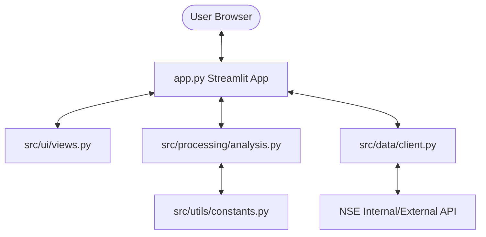

# Project Architecture

## System Diagram (Conceptual)

## Module Responsibilities

### Root
- `app.py`: Main entry point, sidebar configuration, routing between Deep Dive and Screener modes.

### `src/data/`
- `client.py`: Handles all external data fetching logic, including index lists and historical price/ratio data.

### `src/processing/`
- `analysis.py`: Data cleaning, merging price and ratio dataframes, and calculating statistical metrics (percentiles, z-scores, trends).

### `src/ui/`
- `views.py`: Component-level rendering functions for charts, metric cards, and the screener table.
- `styles.py`: Custom CSS loading for Streamlit UI.

### `src/utils/`
- `constants.py`: Centralized storage for API endpoints, date formats, and default configuration values.
